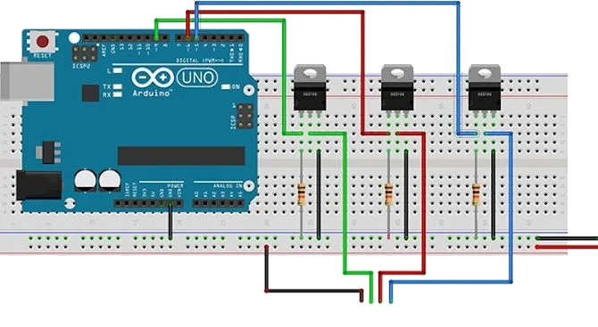

# Piano RGB
Script that reads the Piano MIDI and light the LED RGB Strip according to the notes being played.

## Installing dependencies

>The best way is to create a python environment, you can do this using
>```
>python -m venv .venv
>```
>then activate it running `./.venv/Scripts/activate, you can learn more about this here [Python Venv](https://docs.python.org/3/library/venv.html)

To install the dependencies you need to run:
```
pip install python-rtmidi pyserial colour
```

## Arduino

You need an arduino as the controller for the lights, the sketch in the folder arduino is the one needed to upload to your arduino

The schematic is:

